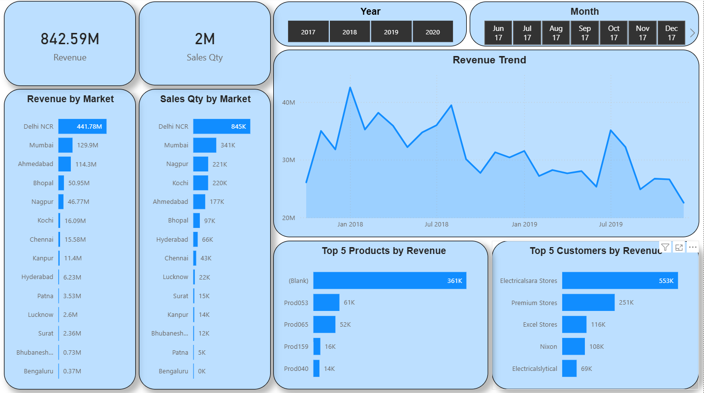
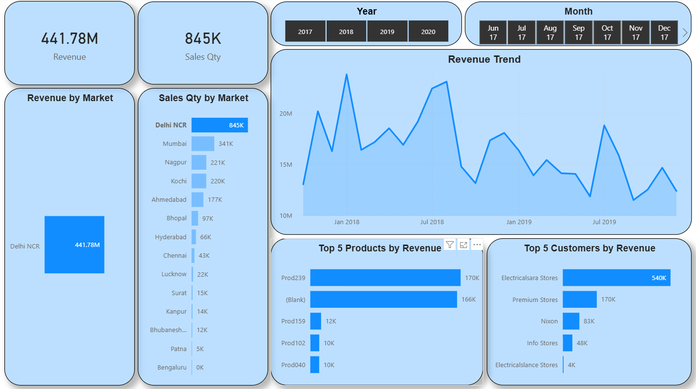
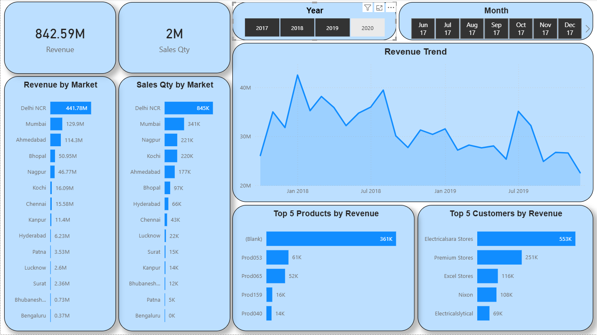
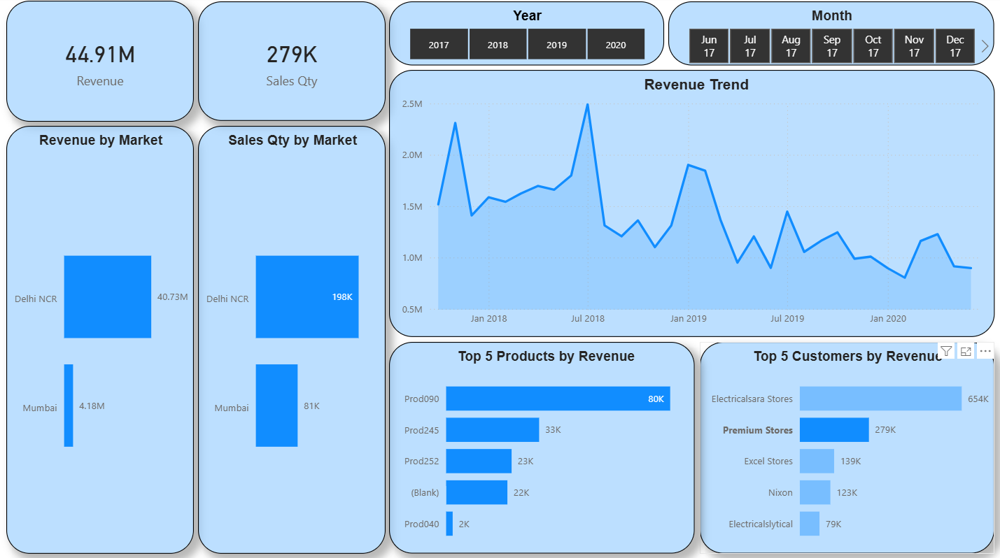
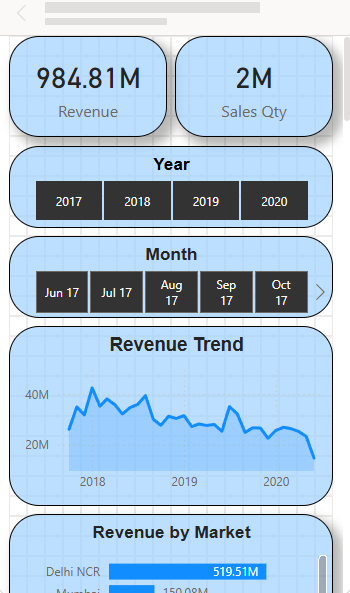
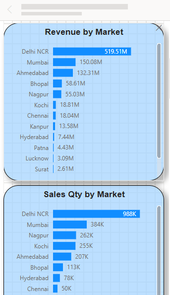

# PowerBI Sales Project

## Overview

This project is a Power BI dashboard created to analyze sales data and generate meaningful insights. It focuses on understanding revenue trends, customer behaviour, and market performance through interactive visualizations.

## Objectives
- Analyze overall sales performance.
- Identify revenue trends over time.
- Compare performance across different markets.
- Highlight top customers and products.
- Enable interactive filtering for deeper analysis.
- Optimized dashboard design for mobile view.

## Tools & Technologies
- Microsoft Power BI Desktop
- SQL (for data querying and cleaning)

## Data Preparation
- Performed data cleaning using SQL.
- Handled missing and inconsistent data.
- Merged multiple tables.
- Designed a star schema for efficient data modeling.

## Dashboard Preview

### Desktop View

### Mobile View

## How to Use
Download the .pbix file and open it in Power BI Desktop to explore the interactive dashboard.

## Project Files
- powerbi_sales_insights.pbix - PowerBI dashboard file
- screenshorts/ - Dashboard images

## Key Insights
- Revenue trends can be analyzed across different time periods.
- Market wise comparison helps identify high performing regions.
- Top customers and products contribute significantly to overall revenue.

## Conclusion 
This project demonstrates the use of data cleaning, data modeling, and visualization techniques to transform raw data into actionable insights using Power BI.
